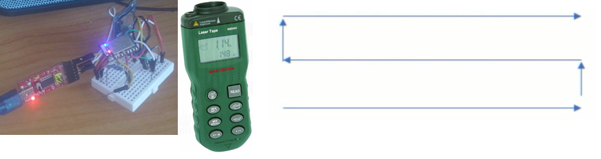
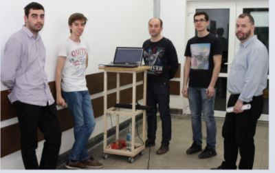
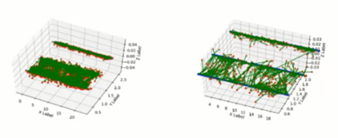
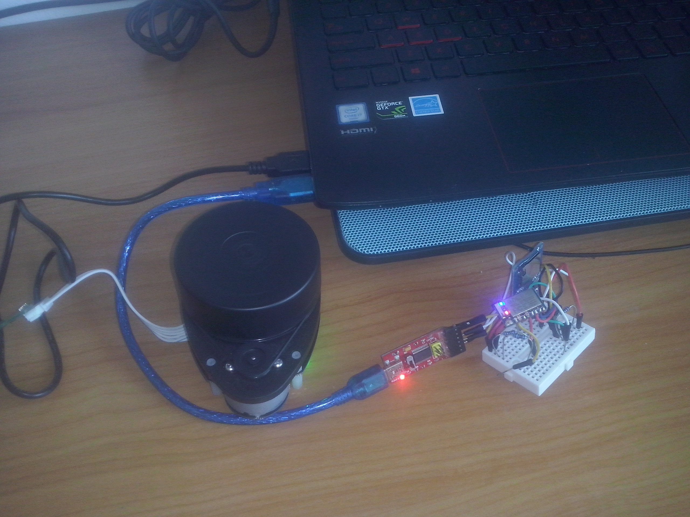
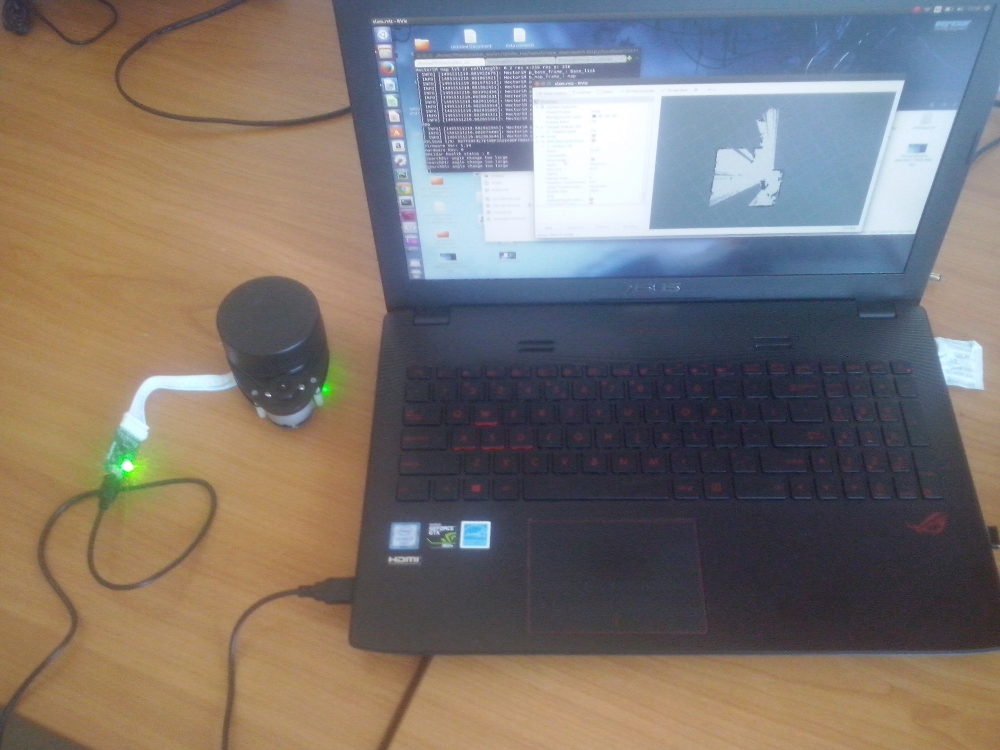
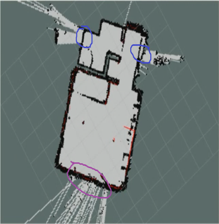

# LOMAR
Intelligent indoor LOcalization and MApping based on a Robotic platform LOMAR

This repository contains the research on an Indoor localization system based on RSS (Received Signal Strenght) from AP(Acces Points) or WLAN routers. The ideea is that many buildings nowadays have tens or hundreds of routers inside them. All the signal traveling through the air can be used for localization. One way to do this is to triangulate the position knowing the coordinates of all routers. But not everybody has acces to all rooms in a building. Our approach intends to use a neural network that learns the positions in the building given the RSS vector.
To automate the process of data collection we have a robot that is able to generate the pair X (RSS vector) and Y (x y coordinates). The robot integrates multiple sensors in order to do accurate localization. The robot must navigate autonomously through the building, compute the location given its sensors and with a WIFI scanner it must collect the RSS vector.
The neural network has a regression head, not a classification head.
The system can be further deployed on a mobile device in order to localize the user.
More details are in the paper.docx.

## Collecting data
We had a laser telemeter, a WiFi scanner, and we walked along a corridor 3 times, each time with about 0.5 meter distance from the previous path, and recorded the Wi-Fi signals from multiple routers. The dataset is also artificially augmented with small variations.

## Training the neural network.
The neural network was a feed forward model with the following structure: 172 input nodes(the number of routers in the building), `[1200,400,100,15]` on the hidden layers and 2 outputs (x,y) coordinates. 
The output of the neural network is very noisy, especially on the test set.

## Apply filtering
As in real life, the user is not teleporting from one place too the other, but is slowly changing position towards its destination. By keeping track of the previous location we can improve the localization using a Kalman Filter. In the following Gif, the blue circle is the groung-truth position, the yellow circle is the output of the neural network, and the red circle is the filtered output.

## Automating the data collection
The previous method for data collection is very painful. It took us 3 hours to collect 3000 measurements.
The first method we tried to automate was by using a Lidar and a 2D reconstruction algorithm that gave us the 2D coordinates. It worked well only in rooms with many features. A corridor is featureless, thus we abandoned this method.

## Using the robot to collect data
We own a Tiago Robot, but so far I only had access to it's simulator. The ideea is to program the robot that is able to operate in any enviroment, even featureless. It has to cover every 30cm^2 of the floor and collect the data.

